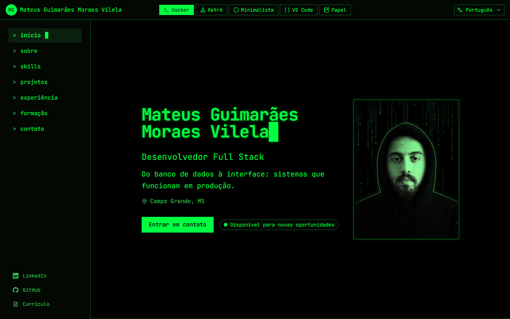
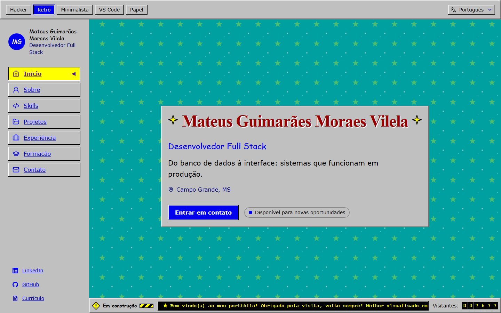
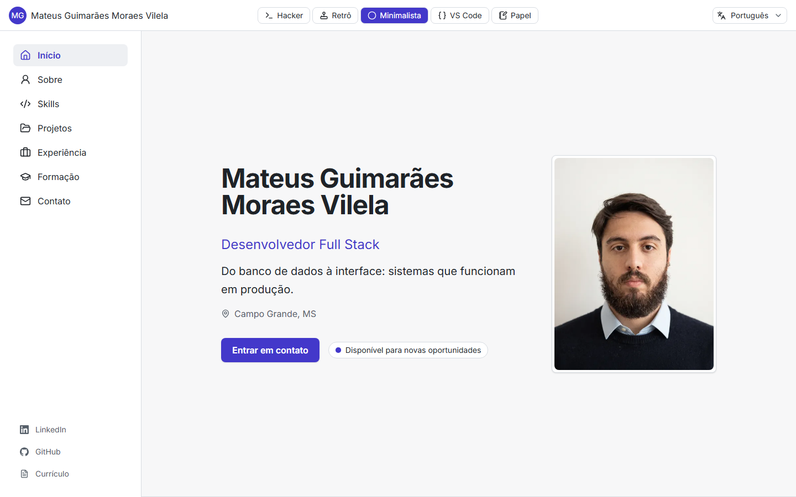
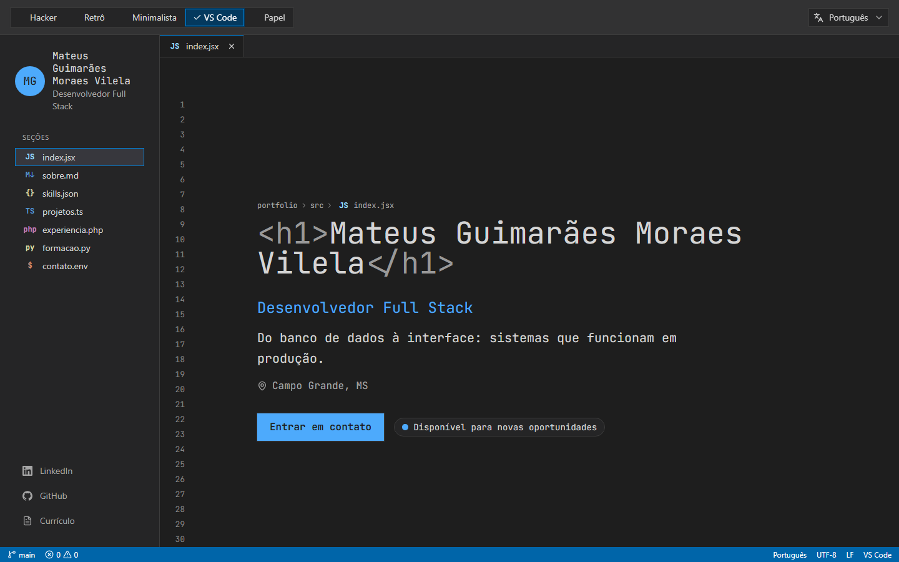
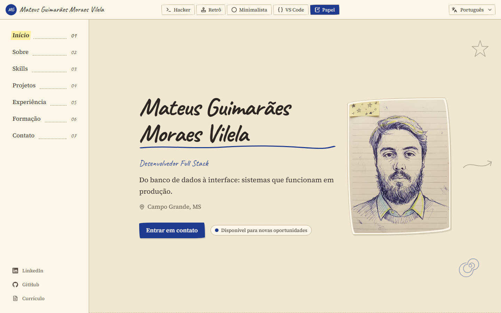

# Portfólio com temas dinâmicos

**Site:** [portfolio-themes.mateusguimaraesmoraes14.workers.dev](https://portfolio-themes.mateusguimaraesmoraes14.workers.dev)

Portfólio de desenvolvedor full stack em que o visitante troca a identidade visual da página inteira com um clique, sem recarregar e sem perder o lugar onde estava. São cinco temas (Hacker, Retrô, Minimalista, VS Code e Papel), três idiomas (português, inglês e espanhol) e um único layout por baixo.

O próprio site é a demonstração técnica: design system baseado em tokens, troca instantânea de tema, internacionalização com detecção pelo navegador, navegação com scroll spy, acessibilidade WCAG AA, performance (Lighthouse 90+ em todos os temas) e testes automatizados.

## Temas

| Hacker                                            | Retrô                                        |
| ------------------------------------------------- | -------------------------------------------- |
|        |     |
| **Minimalista**                                   | **VS Code**                                  |
|  |  |
| **Papel**                                         |                                              |
|          |                                              |

- **Hacker:** terminal verde sobre preto, comandos na sidebar, nome digitado letra a letra e chuva de caracteres (desligável).
- **Retrô:** web dos anos 90, com janelas em relevo, letreiro, selo "em construção" e um contador de visitas falso.
- **Minimalista:** foco no conteúdo, um único acento e muito espaço.
- **VS Code:** a sidebar vira Explorer (`sobre.md`, `projetos.ts`...), cada seção é um arquivo com números de linha, e há abas e status bar.
- **Papel:** caderno com textura, títulos manuscritos, marca-texto e post-its.

Todo tema respeita `prefers-reduced-motion`: com movimento reduzido, nada pisca, digita, gira ou rola suavemente.

## Stack

- **Front:** React, Vite (SPA), TypeScript strict, Tailwind CSS v4 ligado a CSS variables, i18next. Animações em CSS.
- **Qualidade:** ESLint (`strictTypeChecked` + jsx-a11y strict), Prettier, Vitest + Testing Library, Playwright, axe.
- **Publicação:** Cloudflare Workers com static assets. Imagem Docker (nginx) opcional para rodar localmente.

## Como rodar

Pré-requisito: Node.js 22.12+ ou 24 (a versão do CI está em `.nvmrc`). O app fica em `apps/web`, num monorepo com npm workspaces. Rode os comandos da raiz.

```bash
npm install
npm run dev                              # servidor de desenvolvimento (Vite)
npm run build                            # build de produção em apps/web/dist
npm run check                            # formatação, lint, tipos e testes unitários
npm run test:coverage                    # testes unitários com cobertura (meta de 80%)
npx -w web playwright install chromium   # só na primeira vez
npm run test:e2e                         # testes e2e (desktop e mobile)
```

Para links de tema e idioma, use `?tema=hacker` e `?lang=en`, ou as páginas `/pt/`, `/en/` e `/es/`. Eles contam como escolha do visitante e saem da URL depois de aplicados.

Conteúdo gerado (rode de novo quando o conteúdo mudar e versione o resultado):

```bash
npm run resume        # currículos em PDF (pt-BR, en, es) em apps/web/public/resume/
npm run og            # imagens de compartilhamento e ícone em apps/web/public/
npm run screenshots   # prints dos temas para este README, em docs/screenshots/
```

Variáveis de ambiente: copie `apps/web/.env.example` para `apps/web/.env`. Toda variável `VITE_*` vai para o navegador e é pública, então nunca coloque segredos nelas. `VITE_SITE_URL` é a URL pública do site, usada no build em canonical, Open Graph e sitemap.

### Com Docker (opcional)

```bash
docker build -f apps/web/Dockerfile --build-arg VITE_SITE_URL=http://localhost:8080 -t portfolio-web .
docker run --rm -p 8080:80 portfolio-web   # http://localhost:8080
```

A imagem serve o build com nginx e serve para ver o site localmente. A Content Security Policy e os demais headers de segurança são aplicados só na Cloudflare (veja abaixo).

## Arquitetura

- **Layout único, temas como skins.** Navbar e sidebar são as mesmas em todos os temas. Um tema troca a aparência em dois níveis:
  - **tokens** (`--theme-*`: cores, fontes, raio e sombra em `src/themes/tokens/<tema>.css`), aplicados por `<html data-theme>`;
  - **slots** opcionais (item da sidebar, título de seção, botão de tema, decoração), que renderizam só o conteúdo. Link, foco e `aria-current` ficam sempre no layout.
- **Tailwind só com classes semânticas.** A paleta padrão foi removida; os componentes usam `bg-surface`, `text-fg`, `font-heading` etc., que apontam para os tokens. Um teste impede cores fixas fora dos arquivos de tema, e outro garante contraste AA em todos os pares de cores de todos os temas.
- **Sem flash.** Um script inline no `index.html` decide tema e idioma antes da primeira pintura: link, escolha salva ou `prefers-color-scheme` (escuro abre o VS Code). O i18n inicializa de forma síncrona antes do render.
- **Um chunk por tema.** Os slots de cada tema são baixados sob demanda. O do tema ativo é pedido junto com o JS principal (`modulepreload`) e os outros quando o navegador fica ocioso. Trocar de tema não recarrega a página nem muda a seção.
- **Conteúdo separado de apresentação.** Dados tipados em `src/content/<idioma>/` e textos de interface em `src/i18n/locales/`. Testes garantem paridade entre os três idiomas, e que nenhum conteúdo proibido (como telefone) aparece no site ou nos PDFs.
- **Navegação.** Um hook (`useActiveSection`) sincroniza a sidebar com a rolagem: `IntersectionObserver` numa faixa de leitura, topo e fim tratados à parte. Um clique destaca na hora, sem passar pelas seções do caminho, grava o hash sem poluir o histórico e move o foco para o título.
- **SEO por idioma.** O build gera `/pt/`, `/en/` e `/es/`, cada um com title, description, Open Graph, Twitter card, canonical, hreflang e JSON-LD (`Person`) no próprio idioma, além de `robots.txt` e `sitemap.xml`. A raiz detecta o idioma e é o `x-default`.
- **Acessibilidade.** Landmarks, skip link, foco visível e nunca escondido atrás das barras fixas, drawer mobile com `<dialog>` nativo e ornamentos fora da árvore de acessibilidade. O axe roda em cada tema e em cada idioma.

```
apps/web/
  e2e/          testes Playwright (axe, teclado, temas, i18n, SEO, CSP...)
  public/       currículos, imagens de compartilhamento e ícones
  scripts/      plugins do build (SEO, headers, chunks de tema) e geradores
  src/
    app/        AppShell e providers
    content/    conteúdo tipado por idioma
    hooks/      navegação (scroll spy) e movimento reduzido
    i18n/       detecção de idioma, inicialização e traduções
    layout/     navbar, sidebar, drawer, seletores
    sections/   Hero, Sobre, Skills, Projetos, Experiência, Formação, Contato
    themes/     registro, provider, tokens e slots de cada tema
```

## Testes e CI

O GitHub Actions roda em todo push e pull request:

- formatação, lint e tipos;
- testes unitários com cobertura mínima de 80% nos módulos de tema, i18n e navegação, com o resumo no job e o relatório como artefato;
- e2e no Chromium, em viewport desktop e mobile.

Os e2e cobrem os critérios de aceite do projeto:

- troca e persistência de tema;
- clique versus rolagem e hash na URL;
- idioma inicial pelo navegador;
- drawer mobile e currículo por idioma;
- axe em todas as combinações de tema e idioma;
- navegação só com teclado;
- movimento reduzido;
- a CSP gerada no build, que não pode bloquear nada do próprio site.

## Publicação na Cloudflare

O site é publicado como **Worker com static assets** (não Pages), sem código de servidor. O `wrangler.jsonc` da raiz aponta para `./apps/web/dist`. O build gera também o arquivo `_headers`, que a Cloudflare aplica:

- **segurança:** Content Security Policy estrita (só o próprio domínio, script inline liberado por hash), HSTS, `nosniff`, `X-Frame-Options`, `Referrer-Policy` e `Permissions-Policy`;
- **cache:** imutável para os arquivos com hash; os demais revalidam ou ficam em cache curto.

### Primeiro deploy

1. No painel da Cloudflare, crie um Worker importando este repositório do GitHub. O nome do projeto precisa ser `portfolio-themes`, igual ao `name` do `wrangler.jsonc`.
2. Em **Build**, configure:
   - **Build command:** `npm run build`
   - **Deploy command:** `npx wrangler deploy`
   - **Diretório raiz:** a raiz do repositório
3. Em **Variáveis de build**, adicione `VITE_SITE_URL` com a URL pública, sem barra no fim. Por exemplo: `https://portfolio-themes.<sua-conta>.workers.dev`.
4. Salve e faça o deploy. A cada push na branch configurada, a Cloudflare refaz o build e publica.

Para conferir localmente o que será publicado, com os headers aplicados:

```bash
npm run build
npx wrangler dev               # http://localhost:8787
npx wrangler deploy --dry-run  # valida a configuração sem publicar
```

### Domínio próprio

1. O domínio precisa estar na Cloudflare (DNS gerenciado por ela).
2. No Worker, abra **Settings → Domains & Routes → Add → Custom domain** e informe o domínio, por exemplo `seudominio.com.br`. A Cloudflare cria o registro DNS e o certificado.
3. Atualize `VITE_SITE_URL` para o novo domínio e faça um novo deploy. Canonical, Open Graph, hreflang e sitemap são gerados no build a partir dessa variável.

## Conteúdo e privacidade

- Telefone não aparece em lugar nenhum, nem no site nem nos currículos.
- Os projetos privados mostram só descrição e tecnologias, sem links de código ou de produção e sem dados de clientes.
- O contador de visitas do tema Retrô é decorativo: um número aleatório guardado no próprio navegador, sem nenhuma requisição.

## Licença

[MIT](LICENSE)
